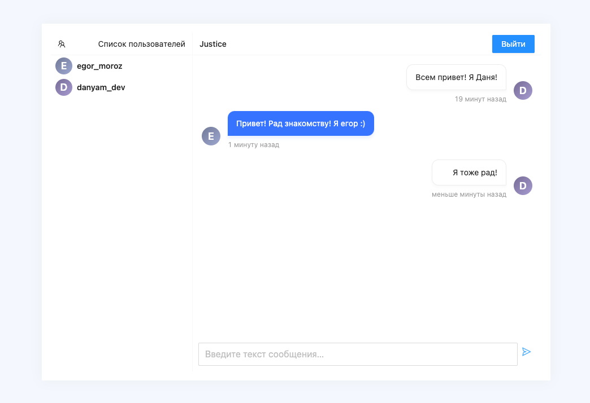

# Проект "Чат"
Стек:
- React
- TypeScript
- Ant-Design
- Express
- Socket.IO
- Mongo DB

### Функционал приложения следующий:
- при первом запуске приложение предлагает пользователю  авторизоваться/зарегистрироваться;
- выполняется подключение к серверу через веб-сокеты и вход в список комнат;
- создание комнат, удаление комнат (только своих);
- можно зайти в комнату, увидеть список пользователей и диалог;
- пользователи обмениваются сообщениями в реальном времени;
- сообщение записывается в базу данных;

### Запуск проекта:

Устанавливаем сначала зависимости для `фронта`.
```
yarn
```
Затем переходим в директорию для `сервера` и устанавливаем зависимости.
```
cd backend
yarn
```
Нам потребуется одновременно запускать два сервера (для клиента и самого сервера), поэтому установили `concurrently` — утилиту для одновременного выполнения нескольких команд, определенных в файле `package.json:`

Запуск
```
yarn
yarn dev
```

### Библиотеки

`Фронт:`
- react-router-dom — библиотека для маршрутизации на стороне клиента;
- socket.io-client — клиент socket.io;
- sass — препроцессор CSS;
- axios - библиотека, позволяющая делать HTTP-запросы;
- antd - олноценная дизайн-система, визуальный язык;
- ant-design/icons - иконки;
- tinycolor2 - небольшая и быстрая библиотека для работы с цветами и их преобразования в JavaScript;
- date-fns - библиотека, которая предлагает вам целый ряд вспомогательных методов для работы с датами в JavaScript

`Сервер:`
- express — Node.js-фреймворк для разработки веб-серверов;
- socket.io — библиотека, облегчающая работу с веб-сокетами;
- mongoose — ORM для работы с MongoDB;
- cors — утилита для работы с CORS;
- nodemon — утилита для запуска сервера для разработки.
- bcryptjs - адаптивная криптографическая хеш-функция формирования ключа, используемая для защищенного хранения паролей;
- jsonwebtoken - используется для передачи данных для аутентификации в клиент-серверных приложениях;
- express-validator - позволяет стандартизировать ответы на ошибки валидации;
- config - позволяет нам определить набор параметров по умолчанию.

### Проверка работоспособности приложения
Находясь в корневой директории проекта, выполняем команду `yarn dev` и открываем браузер по адресу http://localhost:3000.

    Форма авторизации


    Форма регистрации


    Страница комнат


    Страница комнаты (чат)

